# 1.简介
## 1.1.概念
    C++是一种中级语言，综合高级语言和低级语言的一种中级语言。
## 1.2.面向对象的程序设计
    封装 抽象 继承 多态
## 1.3.标准库
    核心语言：构件块：`变量，数据类型和变量`.
    C++标准库，提供了大量的函数，用于操作文件以及字符串
    标准模块库（STL），提供了打量的方法，用于操作数据结构等。
## 1.4.标准化
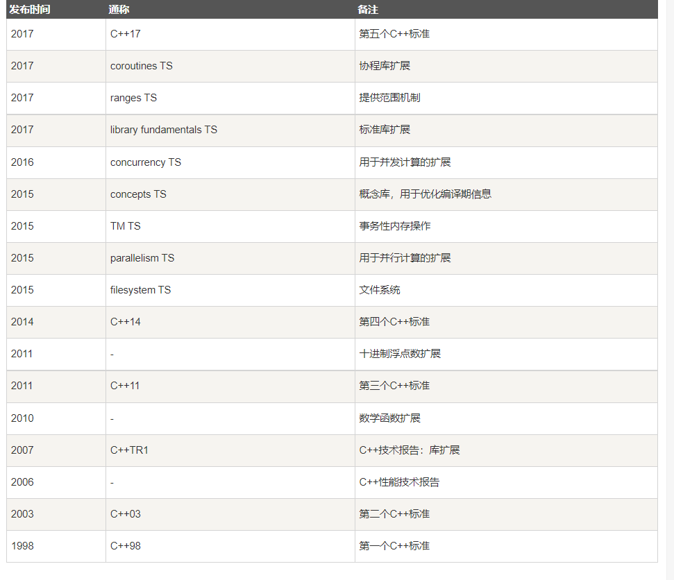
******
# 2.C++基本语法
## 2.1.对象（类的示例）
&emsp;&emsp;对象具有状态和行为。例如：一只狗的状态-名称、品种、行为-摇动，叫唤
## 2.2.类
&emsp;&emsp;描述对象行为状态的模板/蓝图。
## 2.3.方法
&emsp;&emsp;一种方法表示一种行为，一个类可以包含多个方法。可以在方法中写逻辑、操作数据以及执行所有动作.
## 2.4.即使变量
&emsp;&emsp;每个对象都有其独特的即时变量，对象的状态都由这些即使变量的值创建的。
## 2.5.分号和语句块
&emsp;&emsp;每个语句以分号作为结束，大括号括起来的为语法块。
## 2.6.C++标识符
&emsp;&emsp;由字母和下划线以及数字，必须以字母或下划线开头。
## 2.7C++关键字
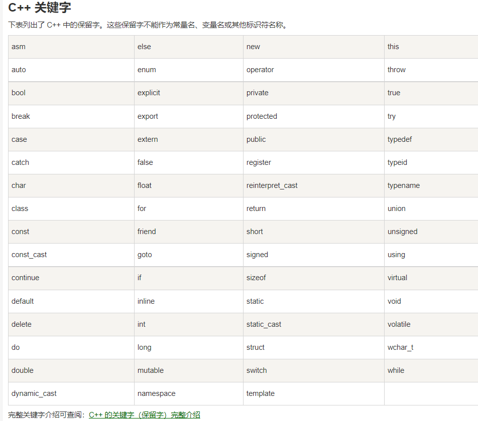。
## 2.8C++中的空格
&emsp;&emsp;空白符 编译器会完全忽略它。
## 2.8C++中的注释
&emsp;&emsp;`//` 单行注释
&emsp;&emsp; `/*.....*/`多行注释
******
# 3.C++ 数据类型
## 3.1.基本数据类型
&emsp;&emsp;: 七种基本类型：布尔型：bool 、字符型 char 、整型 int 、浮点型 float、 双浮点型 double、 无类型 void、 `宽字符型 wchar_t(typedef short int wchar_t)`。
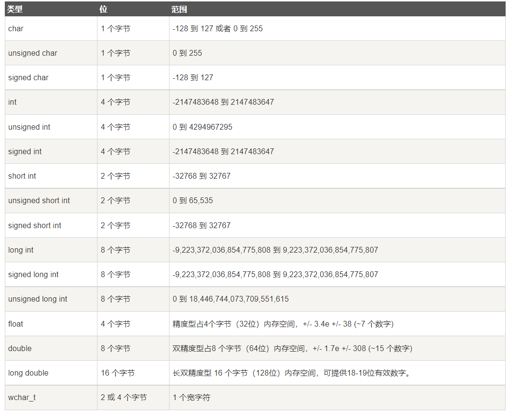
## 3.2.typedef
&emsp;&emsp;typedef type `newname`
## 3.3.枚举类型
&emsp;&emsp;将变量一一列举出来。
```c
enum 枚举名
{
    标识符[=整型常量]
    标识符[=整型常量]
    ...
    标识符[=整型常量]
}枚举变量
```
>默认第一个变量为0，第二个为1，依次类推。。。。。
******
## 4.C++ 变量类型
&emsp;&emsp;变量其实只不过是程序可操作的存储区名称。变量名称可以由字母、下划线和字符组成。
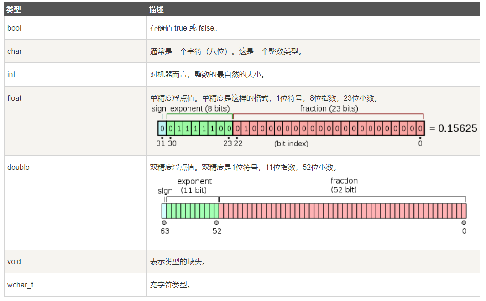
## 4.1.C++ 中的变量定义
`type variable_list`
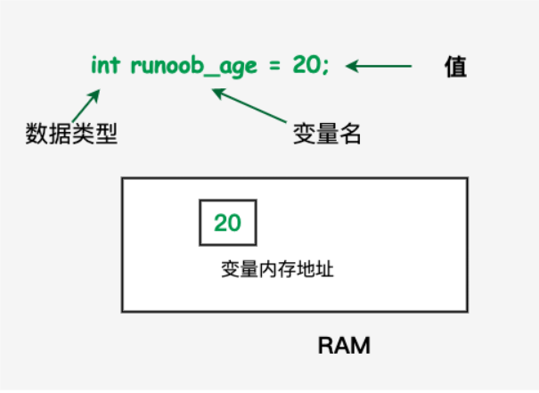
## 4.2.C++ 中的变量声明
&emsp;&emsp;变量声明向编译器保证变量以给定的类型和名称存在，变量声明只在编译时有它的意义，在程序连接时编译器需要实际的变量声明。
## 4.3.C++ 中左值（Lvalue）和右值（Rvalues）
&emsp; &emsp;左值: 指向内存位置的表达式被称为`左值`，左值可以出现在赋值号右边。
&emsp; &emsp;右值: 储存在内存中某地址的数值。右值可以出现在赋值号右边。
******
# 5.C++ 变量作用域
## 5.1.局部变量
&emsp;&emsp;1.在函数或代码块内部声明的变量为局部变量。
&emsp;&emsp;2.在函数参数的定义中声明的变量为形式参数。
&emsp;&emsp;3.在函数外部声明的变量为全局变量。
## 5.2.全局变量
&emsp;&emsp;1.在函数外部定义的变量。
******
# 6.常量
## 6.1.C++ 常量
&emsp;&emsp;1.字面值：常量是固定值，在程序执行期间不会改变。
&emsp;&emsp;2.常量可以是任何的基本数据类型，可分为整型数字、浮点数字、字符、字符串和布尔值。
&emsp;&emsp;3.常量类似于常规变量、只不过常量的值在定义后不能进行修改。
## 6.2.整数常量
&emsp;&emsp;1.十进制。
&emsp;&emsp;2.十六进制 ：前缀为 0x。
&emsp;&emsp;3.八进制：前缀为 0。
&emsp;&emsp;4.整数常量也可以带一个后缀，由U和L组合，U表示无符号整数、L表示长整数。
## 6.3.浮点常量
&emsp;&emsp;1.浮点常量：由整数、小数点、小数部分和指数部分。
&emsp;&emsp;2.浮点常量：可以由小数形式和指数形式来表示。
## 6.4.布尔常量
&emsp;&emsp;1.TRUE代表`真`，FALSE表示`假`。
## 6.5.字符常量
&emsp;&emsp;1.括在单引号中的变量，如果常量以`L`(大写),则表示它是一个宽字符常量，必须储存在`wchar_t`变量中。
&emsp;&emsp;2.转义字符码。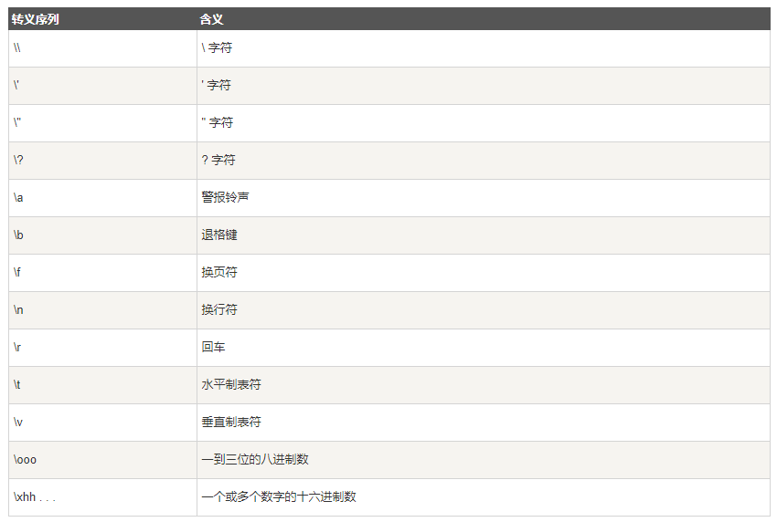
## 6.6.定义常量
&emsp;&emsp;1.#define预编译。
&emsp;&emsp;2.const关键字。
******
# 7.C++修饰符类型
## 7.1.数据类型修饰符：
&emsp;&emsp;`signed`:可修饰字符型、整型；
&emsp;&emsp;`unsigned`:可修饰字符型、整型；
&emsp;&emsp;`long`：可应用于整型、双精度型；
&emsp;&emsp;`short`：可应用于整型；
## 7.1.C++中类型限定符：
&emsp;&emsp;1.提供变量的额外信息；
&emsp;&emsp;2.const:const类型的对象在程序执行期间不能被修改；
&emsp;&emsp;3.volatile:修饰符volatile告诉编译器不需要优化volatile声明的变量，让程序可以直接从内存中读取变量。对于一般的变量，编译器会对变量进行优化，将内存中的变量值放在寄存器中以加快读、写效率；
&emsp;&emsp;4.restrict:由restrict修饰的指针是唯一一种访问它所指向的对象的方式。
******
# 8.C++存储类
## 8.1.定义以及常见存储类型：
&emsp;&emsp;1.定义：C++程序中变量/函数的范围（可见性）和生命周期；
&emsp;&emsp;2.常见存储类型：auto、register、static、extern、mutable、thread_local(C++11)；
## 8.2.auto存储类
&emsp;&emsp;1.声明变量时根据表达式自动推断该变量类型；
&emsp;&emsp;2.声明函数时函数返回值的占位符；
## 8.3.register存储类
&emsp;&emsp;定义存储在寄存器而不是ram中的变量；不能对该变量使用一元运算符`&`
## 8.4.static存储类
&emsp;&emsp;1.局部变量：指示编译器在程序的生命周期内保持局部变量的存在，不需要在它每次进入和离开作用域时进行创建和销毁；
&emsp;&emsp;2.全局变量：变量作用域限制在它声明的文件内；
## 8.5.extern存储类
&emsp;&emsp;提供一个全局变量的引用，在多个文件中使用，声明一个已经被定义过的变量和函数；
## 8.6.mutable存储类
&emsp;&emsp;仅仅适用于类；
## 8.7.thread_local存储类
&emsp;&emsp;使用thread_local说明符声明的变量仅可在它在其上创建的线程上访问；
&emsp;&emsp;变量在创建线程时创建，并在销毁线程时销毁；
******
# 9.C++ 运算符
## 9.1.定义及常见运算符类型
&emsp;&emsp;1.定义：告诉编译器执行特定的数学及逻辑操作的符号；
&emsp;&emsp;2.常见运算符：算术运算符、关系运算符、逻辑运算符、位运算符、赋值运算符、杂项运算符；
## 9.2.算术运算符
&emsp;&emsp;常见算术运算符：`+`、`-`、`*`、`\`、`++`、`--`;
## 9.2.关系运算符
&emsp;&emsp;常见关系运算符：`==`、`!=`、`>`、`<`、`>=`、`<=`;
## 9.3.逻辑运算符
&emsp;&emsp;常见逻辑运算符：`&&`、`||`、`!`;
## 9.4.位运算符
&emsp;&emsp;常见位运算符：`&`、`|`、`^`、`~`、`>>`、`<<`;
## 9.5.赋值运算符
&emsp;&emsp;常见位运算符：`=`、`+=`、`-=`、`*=`、`/=`、`%=`、`<<=`、`>>=`、`&=`、`^=`、`|=`;
## 9.6.杂项运算符
&emsp;&emsp;常见杂项运算符：`sizeof`、`condition?X:Y`(条件运算符)、`,`(逗号运算符)、`./->`(成员运算符)、`cast`(强制类型转换符)、`&`(指针运算符)、`*`(指针运算符/间接访问符);
## 9.7.C++中的运算符优先级
&emsp;&emsp;下表中优先级从高到低！
&emsp;&emsp;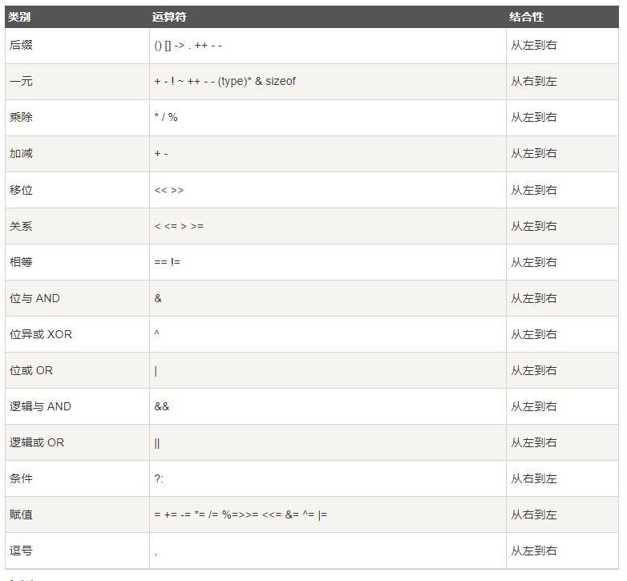
***
# 10.C++循环
## 10.1.定义：
&emsp;&emsp;可以多次执行的程序体；
## 10.2.循环类型
&emsp;&emsp;1.当给定条件为`真`时，重复执行循环语句；
&emsp;&emsp;2.允许编写一个特定次数的循环；
&emsp;&emsp;3.循环头部为循环体，循环尾部判断循环条件，该循环`至少执行一次`；
## 10.3.循环控制语句
&emsp;&emsp;1.break语句：终止`loop`和`switch`语句；
&emsp;&emsp;2.continue语句：跳过循环的主题部分，开始下一个循环；
&emsp;&emsp;3.goto语句：将控制语句转移到被标记的语句；（不建议使用）
## 10.4.无限循环
&emsp;&emsp;循环结构中，判断条件永远不为`真`,则进入无限循环；
***
# 11.C++判断
## 11.1.定义和常见的判断语句
&emsp;&emsp;1.根据判断条件的`真`或`假`执行不同的程序体；
&emsp;&emsp;2.常见的判断语句：`if语句`、`if ...esle...`、`嵌套if`、`switch`、`嵌套switch`；
## 11.2.判断语句
&emsp;&emsp;1.`if语句`：判断条件为一个布尔表达式，当判断布尔表达式满足判断条件时执行程序体；
```c
    if(boolean_expression)// 判断条件：布尔表达式
    {
        // 程序体；
    }
```
&emsp;&emsp;2.`if...else..语句`：判断条件为一个布尔表达式，当判断布尔表达式满足判断条件时执行程序体1,不满足表达式时，执行程序体2；
```c
    if(boolean_expression)// 判断条件：布尔表达式
    {
        // 程序体1；
    }
    else
    {
         // 程序体2；
    }
```
&emsp;&emsp;3.`嵌套if语句`：在一个`if`或`if...else..`语句中使用其他`if`或`if...else..`；
```c
    if(boolean_expression1)// 判断条件：布尔表达式
    {
        if(boolean_expression2)// 判断条件：布尔表达式
        {
            // 程序体1；
        }
        else
        {
            // 程序体3；
        }
    }
    else
    {
         // 程序体2；
    }
```
&emsp;&emsp;3.`switch`语句：
&emsp;&emsp;&emsp;&emsp;3.1.switch中判断语句必须为`整型`、`枚举类型`以及`class`类型（其中class有一个转换函数将其转换为`整型`或`枚举型`）；
&emsp;&emsp;&emsp;&emsp;3.2.在switch语句中有任意个`case`语句,其中case语句后要跟一个比较值和冒号；
&emsp;&emsp;&emsp;&emsp;3.3.其中case语句中的`constant-expression`必须与switch中的变量有相同类型，且必须时一个`字面值`或`常量`；
&emsp;&emsp;&emsp;&emsp;3.4.其中case语句中的条件满足时，执行case后所有语句直到`break`;
&emsp;&emsp;&emsp;&emsp;3.5.遇到`break`语句时，控制流跳转至switch下一条语句;
&emsp;&emsp;&emsp;&emsp;3.6.可以在switch语句最后一个case语句后放置一个`default`语句，当上面所有case均不满足时执行;
```c
    switch(expression)
    {
        case constant-expression :
            statement(s);
            break;
        case constant-expression :
            statement(s);
            break;
        default :
            statement(s);
    }
```
&emsp;&emsp;3.`嵌套switch`语句：在一个switch语句中使用其他switch语句；
```c
    switch(expression1)
    {
        case constant-expression1 :
            statement(s);
            switch(expression2)
            {
                case constant-expression2 : 
                    statement(s);
                    break;
                case constant-expression2 : 
                    statement(s);
                    break;
                default :
                    statement(s);
            }
            break;
        case constant-expression1 :
            statement(s);
            break;
        default :
            statement(s);
    }
```
## 11.2.条件运算符`？：`
&emsp;&emsp;`exp1 ? exp2:exp3;` : 当exp1为真时执行exp2,为假时执行exp3;
***
# 12.C++函数
# &emsp;&emsp;函数时一组一起执行一个任务的语句；
## 12.1.定义函数
&emsp;&emsp;1.函数由`函数头`与`函数主体`组成；
&emsp;&emsp;1.1.函数头：由`返回类型`（可能没有）、`函数名称`、`参数`（可能没有）组成；
&emsp;&emsp;1.2.函数主体：执行任务的语句；
## 12.2.函数声明
&emsp;&emsp;1.告诉编译器`函数名称`以及如何`调用函数`；
&emsp;&emsp;2.`return_type function_name(parameter list)`；
&emsp;&emsp;3.在函数声明中，参数名称不重要，只需要知道参数`数据类型`即可；
## 12.3.函数调用
&emsp;&emsp;1.程序调用函数时，`程序控制权`转移至被调用函数，被调用函数`执行完任务时`或`达到执行函数执行结束括号`时，将程序控制权交还给主程序；
&emsp;&emsp;2.调用函数时需将参数传递至被调用函数，且存储函数返回值（若函数有返回值）；
## 12.3.函数参数
&emsp;&emsp;1.声明时函数的参数被称为`形式参数`；
&emsp;&emsp;2.形参为`局部变量`，在进入函数时被创建，离开函数时被销毁；
&emsp;&emsp;3.调用形参的方法：
&emsp;&emsp;&emsp;&emsp;3.1.传值调用：直接将参数值传给形参；    `无法修改传入值`
&emsp;&emsp;&emsp;&emsp;3.2.传址调用：将参数的地址赋给形式参数；`可以修改传入值`
&emsp;&emsp;&emsp;&emsp;3.3.引用调用：把参数引用赋值给形式参数；
## 12.3.参数的默认值
&emsp;&emsp;1.在定义函数时，可以通过给参数列表中参数赋值的方式为参数设置默认值；
&emsp;&emsp;2.在调用函数时，若未向该参数传入值，则使用默认值；
```c
    type_return function(int a, int b = 20)// 形式参数`b`设置默认值
    {


    }
```
## 12.4.Lambda函数于表达式
**待明确**
# 13.数字
## 13.1.定义数字
&emsp;&emsp;C++ 可以定义`short`、`int`、`long`、`float`、`double`等类型的数字；
## 13.2.C++中的数学运算
&emsp;&emsp;内置函数：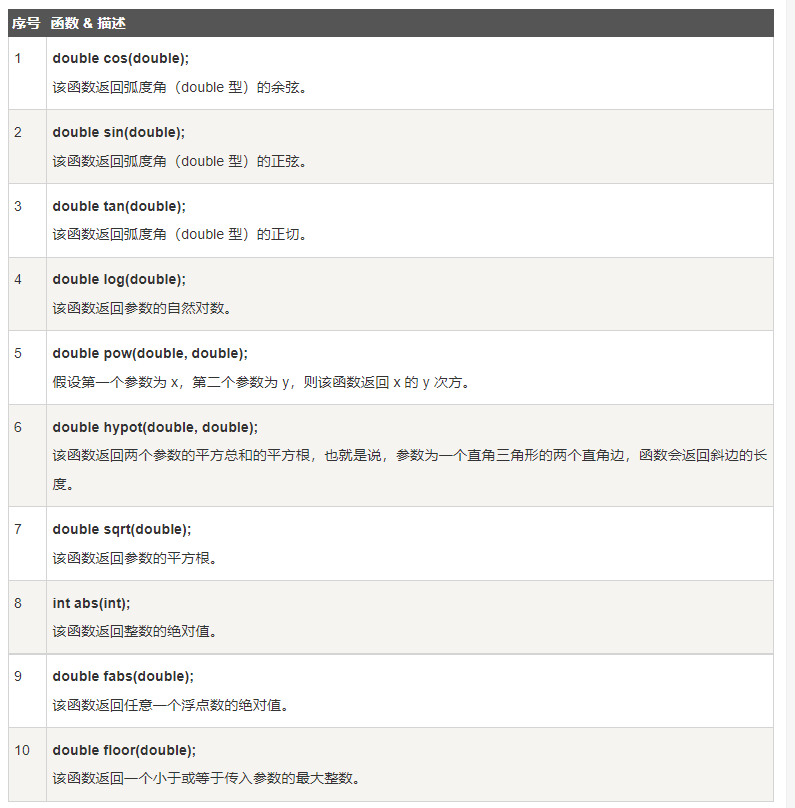;
## 13.2.C++随机数
&emsp;&emsp;`srand()`:随机数发生器；
&emsp;&emsp;`rand()`:返回一个随机数；
***
# 14.数组
## 14.1.概念
&emsp;&emsp;可以存储一个固定大小的相同类型的元素的顺序集合；
## 14.2.声明数组
&emsp;&emsp;1.需要指定数组的元素类型及元素数量；
&emsp;&emsp;2.一维数组：`type arrayName[arraysize]` arraysize：必须是大于零的整数常量；
## 14.3.初始化数组
&emsp;&emsp;逐个元素进行初始化：`double balance[5] = {1、2、3、4、5}；`
## 14.3.访问数组元素
&emsp;&emsp;数组名加索引 `balance[5]`;
## 14.4.多维数组
&emsp;&emsp;二维数组：`type arrayName[x][y]`;
## 14.5.执行数组的指针
&emsp;&emsp;数组名为常量指针，指向数组的第一个元素的地址；
## 14.6.传递数组给函数
&emsp;&emsp;1:`void function (int *array)`: 向函数传递数组`指针`；
&emsp;&emsp;2:`void function (int array[10])`: 向函数传递`固定长度`的数组；
&emsp;&emsp;3:`void function (int array[])`: 向函数传递`长度不固定`的数组；
## 14.7.从函数返回指针
&emsp;&emsp;从函数中返回一个执行数组的指针；
***
# 15.C++字符串
## 15.1. 表达形式
&emsp;&emsp;1.C风格字符串:以`\0`为字符串作为结尾；
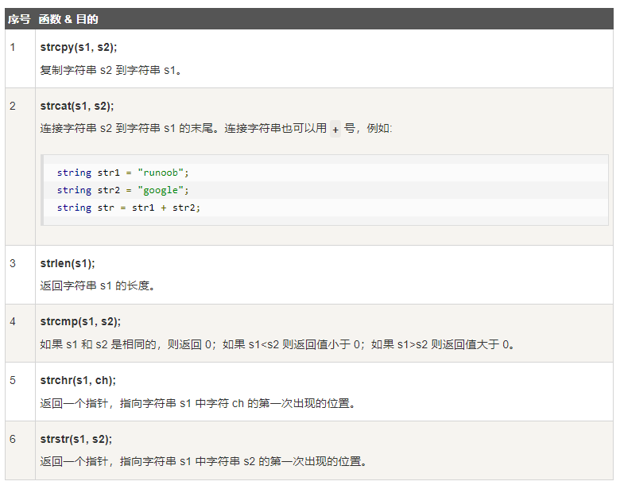
&emsp;&emsp;2.**C++引入`string类`类型；**
示例：
```c
    #include<iostream>
    #include<string>

    int main(int argc, char *argv[])
    {
        std::string str1 = "runoob";
        std::string str2 = "google";
        std::string str3;
        int len;

        str3 = str1;
        std::cout << "str3 : " << str3 << std::endl;

        str3 = str1 + str2;
        std::cout << "str1 + str2 : " << str3 << std::endl;

        len = str3.size();
        std::cout << "str3.size : " << len << std::endl;

        system("pause");
        return 0;
    }
```
***
# 16.C++指针
## 16.1.概念
&emsp;&emsp;概念：指针是一个变量，它指向内存位置的直接地址；
&emsp;&emsp;`type *var-name`:指向`type`类型内存的指针变量；
## 16.2.NULL指针
&emsp;&emsp;1.NUll指针被称为`空指针`, 其值为0；
&emsp;&emsp;2.指针变量声明时，若没有确切的值，可以为指针变量赋一个NULL指针；
## 16.3.C++指针的算术运算
&emsp;&emsp;1.运算类型：`+`、`-`、`++`、`--`;
&emsp;&emsp;2.递增或递减:加/减其数据类型的字节数；
&emsp;&emsp;3.指针的比较：`==`、`<`、`>`,只有相关的指针变量才能进行比较；
## 16.4.C++指针VS数组
&emsp;&emsp;1.指针可以指向数组的起始地址并通过索引访问数组成员；
&emsp;&emsp;2.数组名为数组的地址，但是其是指针常量不可作为左值；
## 16.5.C++多级指针
&emsp;&emsp;1.将指针的地址放在其他指针里形成指针链，通过多级间接寻址进行访问；
## 16.6.C++传递指针给函数
&emsp;&emsp;将函数形参声明为指令类型即可；
## 16.7.C++从函数返回指针
&emsp;&emsp;1.将函数声明为一个指针函数即可；
&emsp;&emsp;2.函数只能返回`全局变量`和`static类型`变量的地址，不可以返回局部变量的地址；
***
# 17.C++引用
## 17.1.概述
&emsp;&emsp;引用是一个别名，它是某个已经存在变量的另一个名字；一旦引用初始化为某个变量后，就可以使用该引用名称或变量名称来指向变量；
## 17.2.C++中创建引用
&emsp;&emsp;1.若将变量名称作为附属在内存位置的标签，则可以将引用当成附属再内存位置的第二标签；
&emsp;&emsp;2.`&`: 读作`引用`；

```c
    int i = 17; // 变量声明
    int& r = i; // r 为初始值为i的整型引用
    double& s = d;// s 为初始值为i的double型引用
```
## 17.3.C++引用 VS 指针 
&emsp;&emsp;1.不存在空引用；
&emsp;&emsp;2.一旦应用被初始化为一个对象，就不能被指向另一个对象。指针可以再任何时候指向另一个对象；
&emsp;&emsp;3.引用必须在创建时初始化；指针可以在任何时候被初始化；
## 17.4.C++将引用作为参数
&emsp;&emsp;1.定义函数时将函数的形参定义成`引用`；
&emsp;&emsp;2.调用函数时只需要填写与定义`引用`数据类型相同的变量即可；
## 17.5.C++函数返回一个引用
&emsp;&emsp;1.用法与返回一个指针类似；
&emsp;&emsp;2.函数返回值一个引用时，则返回一个隐式指针；因此该函数可作为`左值`；
&emsp;&emsp;3.函数返回引用时注意对象的作用域：局部变量不可返回，但`static`变量可以作为返回值；
***
# 18.date & time
## 18.1.概述
&emsp;&emsp;1.C++标准库未提供所谓的日期类型；继承了C语言用于日期和时间操作的结构和函数；
&emsp;&emsp;2.四个与时间相关的类型：`clock_t`、`time_t`、`size_t`、`tm`;
```c
    struct tm
    {
        int tm_sec;   // 秒，正常范围从 0 到 59，但允许至 61
        int tm_min;   // 分，范围从 0 到 59
        int tm_hour;  // 小时，范围从 0 到 23
        int tm_mday;  // 一月中的第几天，范围从 1 到 31
        int tm_mon;   // 月，范围从 0 到 11
        int tm_year;  // 自 1900 年起的年数
        int tm_wday;  // 一周中的第几天，范围从 0 到 6，从星期日算起
        int tm_yday;  // 一年中的第几天，范围从 0 到 365，从 1 月 1 日算起
        int tm_isdst; // 夏令时 
    };
````
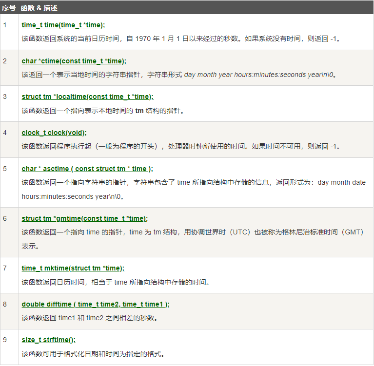
***
# 19.基本的输入和输出
## 19.1.概述
&emsp;&emsp;C++的I/O发生在流中，流是字节序列；
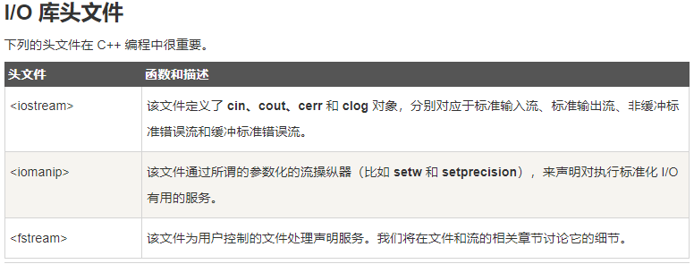
## 19.2.标准输出流
&emsp;&emsp;1.预定义对象`cout`是一个`iostream`类的一个实例；
&emsp;&emsp;2.经常与插入流运算符`<<`结合使用；
## 19.3.标准输入流
&emsp;&emsp;1.预定义对象`cin`是一个`iostream`类的一个实例；
&emsp;&emsp;2.经常与流提取运算符`>>`结合使用；
## 19.4.标准错误流
&emsp;&emsp;1.预定义对象`cerr`是一个`iostream`类的一个实例；
&emsp;&emsp;2.`cerr`附属对象到标准错误设备，通常是显示器；
&emsp;&emsp;3.`cerr`是`非缓冲的`，且每个插入到`cerr`的流会立刻输出；
## 19.5.标准日志流
&emsp;&emsp;1.预定义对象`clog`是一个`iostream`类的一个实例；
&emsp;&emsp;2.`clog`附属对象到标准错误设备，通常是显示器；
&emsp;&emsp;3.`clog`是`缓冲区`，且每个插入到`clog`的都会先存储在缓冲区，知道缓冲区满或缓冲区刷新时才会输出；
***
# 20.C++数据结构
## 20.1.概述
&emsp;&emsp;1.`数组`允许定义可存储`相同类型数据项`的变量；
&emsp;&emsp;2.`结构`:一种用户自定义可用的数据类型，允许储存`不同类型的数据项`；
&emsp;&emsp;3.结构用于一条记录：
```c
    // 定义一本书的属性
    Title: 标题 
    Author:作者 
    Subject:类目
    BookID:书的ID
```
## 20.2.定义结构
&emsp;&emsp;1.`type_name`:结构体名称；
&emsp;&emsp;2.`member_type1 member_name1`:标准的变量定义；
&emsp;&emsp;3.`object_names`:结构体变量；
```c
    struct type_name{
        member_type1 member_name1;
        member_type2 member_name2;
        member_type3 member_name3;
        ...
    }object_names;
```
## 20.3.访问结构体成员
&emsp;&emsp;成员访问符:`.`;
## 20.4.结构作为函数参数
&emsp;&emsp;传参方式与普通变量和指针类似；
## 20.5.指向结构的指针
&emsp;&emsp;1.与变量指针使用规则类似；
&emsp;&emsp;2.成员访问符号`——>`：通过指针访问结构体成员的符号；
## 20.6.typedef关键字
&emsp;&emsp;为数据类型定义新的名字；


