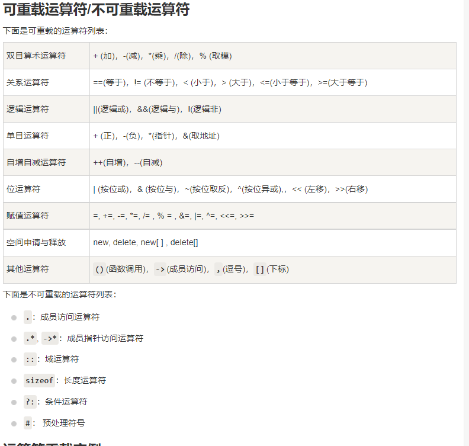

# 面向对象
## 1.C++类和对象
### 1.1.概述
&emsp;&emsp;1.`类`时C++的核心特性，通常被称为用户定义的类型；
&emsp;&emsp;2.`类`用于指定`对象的形式`，包含`数据表示法`和`用于处理数据`的方法；
&emsp;&emsp;3.类中的数据和方法称为`类的成员`;函数在一个类中被称为类的`成员函数`；
## 1.2.C++类定义 
&emsp;&emsp;1.本质上是定义一个`数据类型`的蓝图；
&emsp;&emsp;2.定义了类表示，它所定义类的对象包括了什么，以及可以在该对象上执行哪些操作；
&emsp;&emsp;3.类的关键字为`class`，后面跟`类的名称`;类的主体在一对花括号当中：包含`访问属性`、`变量`、`方法`；类的定义以分号作为结尾；
```c
 /*关键字*/ /*类名*/
    class classname
    {
        Access specifiers:         // 访问修饰符: private/public/protected
            Date members/variables;// 变量
            Member function(){}    //方法
    };                             // 分号结束一个类
```
&emsp;&emsp;4.类的访问属性：
&emsp;&emsp;&emsp;&emsp;4.1.`public`:在类的对象的作用域内，公共成员在`类的外部是可以访问的`;
```c
    class Box
    {
        public:
        double length;  // 盒子长度
        double breadth; // 盒子宽度
        double height;  // 盒子高度
    };
```
## 1.3.定义C++对象
### 1.3.1.概述
&emsp;&emsp;对象是根据类来创建的，声明类的对象就像声明`基本类型和变量`一样；
```c
    /*声明类Box得两个对象*/
    Box Box1;
    Box Box2;
```
## 1.4.访问数据对象
&emsp;&emsp;1.访问类的对象得公共成员可以直接使用直接成员访问运算符`.`;
***
### 1.5.类和对象详解
#### 1.5.1. 类成员函数
&emsp;&emsp;1.类成员函数：把定义和原型都写在类定义内部的函数(与其他变量一样)；
&emsp;&emsp;2.`::`:范围解析运算符；
&emsp;&emsp;3.方法1：在类定义内部写函数原型
```c
    class Box 
    {
        public:
        double length;
        double breadth;
        double height;
        double getVolume(void)
        {
            return length * breadth * heigt;
        }
    };
```
&emsp;&emsp;4.方法2：在类定义写声明、在类定义外部写函数原型；
```c
    class Box 
    {
        public:
        double length;
        double breadth;
        double height;
        double getVolume(void);
    };
    double Box::getVolume(void)
    {
        return length * breadth * heigth;
    }
```
#### 1.5.2. 类访问修饰符
&emsp;&emsp;1.类型访问修饰符：`public`、`protected`、`private`;
&emsp;&emsp;2.一个类可以有`多个标记区`；
&emsp;&emsp;3.每个标记区在下一个标记区开始之前或遇到类主体结束右括号之前有效；
&emsp;&emsp;4.成员和类的默认访问修饰符是`private`;
```c
    class Base
    {
        public：
            // 公共成员
        protected:
            // 受保护成员
        private:
            // 私有成员
    };
```
&emsp;&emsp;5.公有(public)成员
&emsp;&emsp;&emsp;&emsp;5.1.定义：公有成员在程序类的外部是可访问的。
&emsp;&emsp;&emsp;&emsp;5.2.可以不使用任何函数来`设置`和`获取`公有变量的值。
&emsp;&emsp;6.私有(private)成员
&emsp;&emsp;&emsp;&emsp;6.1.`私有`成员变量或函数在类的外部是不可访问的，甚至是不可查看的，只有`类`和`友元函数`可以`访问私有成员`；
&emsp;&emsp;&emsp;&emsp;6.2.默认类的成员都是私有的（如果您没有使用任何访问修饰符，默认为私有成员）；
&emsp;&emsp;7.`protect`(受保护)成员
&emsp;&emsp;&emsp;&emsp;7.1.与`私有成员`十分相似；但是在`派生类`（即子类）中是可访问的。
&emsp;&emsp;&emsp;&emsp;7.2.派生类是由父类派生的一个子类；

#### 1.5.3. 类的构造函数
&emsp;&emsp;1.类的`构造函数`的类的一种的`成员函数`;它会在`每次创建类的新对象时`执行；
&emsp;&emsp;2.构造函数的`名称与类的名称`完全相同，并且不会返回任何类型；
&emsp;&emsp;3.构造函数可用于`为某些成员变量`设置的初始值；
&emsp;&emsp;4.使用初始化列表来初始化字段；
```c
    // 假设一个类C 有X、Y、Z等需要进行初始化
    C::C(double a, double b, double c):X(a),Y(b),Z(c)
    {
        ......
    }
```
#### 1.5.4. 类的析构函数
&emsp;&emsp;1.每次删除对象时执行；
&emsp;&emsp;2.析构函数的名称与类的名称是完全相同的、只是在前面加一个`~`作为前缀，`不返回任何值`，`不带任何参数`；
&emsp;&emsp;3.析构函数有助于在跳出程序（比如关闭文件、释放内存）前释放资源；
```c
    class Line
    {
        public:
            Line();
            ~Line();// 析构函数
        private:
            double length;
    }

    Line::~Line(void)
    {
        /*程序体*/
    }
```
#### 1.5.5. C++拷贝构造函数
&emsp;&emsp;1.创建对象时，是使用`同一类中之前创建对象`来初始化新创建的对象；
&emsp;&emsp;通常用于：
&emsp;&emsp;2.通过使用另一个同类型的对象来初始化新创建的对象；
&emsp;&emsp;3.复制对象把它作为参数传递给函数；
&emsp;&emsp;4.复制对象，并从函数返回这个对象；
&emsp;&emsp;5.如果类中没有定义拷贝函数，编译器会自行定义一个；
&emsp;&emsp;6.如果类带有`指针`，并由`动态内存分配`，则它必须有一个拷贝构造函数；
```c
classname (const classname &obj)// obj是一个对象引用，该对象是用于初始化另一个对象；
{
    // 构造函数的主体；
}
```

#### 1.5.6. C++友元函数
&emsp;&emsp;1.类的友元函数是定义在`类外部`，但有权访问类的`私有成员`和`受保护成员`；
&emsp;&emsp;2.友元函数并`不是成员函数`；
&emsp;&emsp;3.`友元`可以是一个`函数`，也可以是一个`类`；
&emsp;&emsp;4.声明`友元函数`为一个类的友元时，需在函数前加`friend`;
```c
    class Box
    {
            double width;
        public:
            double length;
            friend void printwidth(Box box);// 友元函数
            friend class classTwo;// 友元类
            void setWidth(double wid);
    };
```

#### 1.5.6. 内联函数
&emsp;&emsp;1.编译时，编译器会将该函数的`所有代码副本`放在调用该函数的地方；
&emsp;&emsp;2.对内联函数进行修改后，需要`重新编译`该函数被使用的所有客户端；
&emsp;&emsp;3.如果将一个函数设置为内联函数，则在前面加`inline`;
&emsp;&emsp;4.`类中定义`的所有函数，均为内联函数；
&emsp;&emsp;5.内联函数内`不允许使用循环语句`和`开关语句`；
&emsp;&emsp;6.内联函数定义必须出现在第一次调用之前；

#### 1.5.7. C++ this指针
&emsp;&emsp;1.在C++中，每个对象都可以通过`this`指针来访问自己地址。
&emsp;&emsp;2.this指针是所有成员函数`隐含指针`；
&emsp;&emsp;3.友元函数和静态函数没有`this`指针，因为友元不是类的成员；

#### 1.5.8. C++ 中指向类的指针
&emsp;&emsp;1.有结构指针用法类似；
&emsp;&emsp;2.用`->`成员运算符访问类的成员；

#### 1.5.9. C++类的静态变量
&emsp;&emsp;1.类的数据成员和函数成员都可以被声明为静态变量；
&emsp;&emsp;2.把类声明为静态时，无论创建过多少个类的对象，`静态都只有一个副本`；
```c
    class Runoob
    {
        public:
            static int runoob_age; // 静态变量
            int runoob_user; // 实例变量
        public:
            func{
                int runoob_local;// 局部变量
            };
    };
```
&emsp;&emsp;3.静态成员在类的所有对象中是`共享的`。
&emsp;&emsp;4.创建第一个静态变量时，所有静态数据被初始化为0；
&emsp;&emsp;5.不能将静态变量的初始化放在放置在类的定义中，但是可以放在外部；
&emsp;&emsp;6.将函数成员声明为静态的，就可以把`函数与类`的任何特定独立开来。静态成员函数即使在`类对象不存在`的情况下也能被调用，静态函数只要使用`类名`加`::`就可以访问；
&emsp;&emsp;7.静态成员函数：只能访问静态成员数据，其他静态成员函数和类外部的其他函数；
&emsp;&emsp;8.静态成员函数：不能访问类的`this`指针；

## 2.C++继承
### 2.1.概述
&emsp;&emsp;1.依据另一个类来定义一个类；
&emsp;&emsp;2.指定新建的类继承了一个已有的类的成员即可；已有的类：基类；新建的类：派生类；
```c
    class Animal
    {
        // eat();
        // sleep();
    };
    class Dog:public Animal
    {
        // bark();
    };
```
### 2.2.基类&派生类
&emsp;&emsp;1.一个类可以派生自多个类；
&emsp;&emsp;2.定义一个派生类，我们可以使用一个`类派生列表`来指定基类；
```c
    class derived-class: access-specifier base-class;
    `access-specifier`访问修饰符：public、private、protected;
    `base-class`:基类，若未使用访问修饰符，则默认private;
```
### 2.3.访问控制和继承
&emsp;&emsp;1.派生类可以访问基类中`所有非私有成员`；

&emsp;&emsp;2.派生类无法继承的情况；
&emsp;&emsp;&emsp;&emsp;2.1.基类的构造函数、拷贝构造函数、析构函数；
&emsp;&emsp;&emsp;&emsp;2.2.基类的重载运算符；
&emsp;&emsp;&emsp;&emsp;2.3.基类的友元函数；

### 2.4.继承类型
&emsp;&emsp;1.派生类可以被继承为`public`、`private`、`protected`类型；
&emsp;&emsp;2.不同类型继承规则：
&emsp;&emsp;&emsp;&emsp;2.1.公有继承：当一个类派生自公有基类时，基类的公有成员也是派生类的公有成员，基类的保护成员也是派生类的保护成员，基类的`私有成员不能直接被派生类`访问，但是可以通过调用基类的公有和保护成员访问；
&emsp;&emsp;&emsp;&emsp;2.2.保护继承：当一个类派生自保护基类时，基类的`公有和保护成员`将成为派生类的`保护`成员；
&emsp;&emsp;&emsp;&emsp;2.3.私有继承：当一个类派生自私有基类时，基类的`公有和保护成员`将成为派生类的`私有`成员；

### 2.5.多继承
&emsp;&emsp;一个子类可以有多个父类；它继承多个父类的特性；
```c
    class <派生类名>：<继承方式1><基类1>,<继承方式2><基类2>,...
    {
        <派生类类体>
    };
```
***
## 3.C++重载运算符和重载函数
### 3.1.概述
&emsp;&emsp;1.`重载函数`：在同一个作用域中的`某个函数`指定多个定义；
&emsp;&emsp;2.`重载运算符`：在同一个作用域中的`某个运算符`指定多个定义；
&emsp;&emsp;3.`重载声明`：声明一个在该作用域`已经声明过的函数或方法`具有`相同名称`的声明，但是他们的`参数列表`和`定义`不同；
&emsp;&emsp;4.调用`重载函数`或`重载运算符`时，编译器根据您`使用的参数类型与定义中的参数类型`进行比较，决定选用合适的定义；这一过程称为`重载决策`；
### 3.2.C++中的运算符重载
&emsp;&emsp;1.重载运算符是带有特殊名称的函数：函数名由关键字`operator`和其后`要重载的运算符号`构成的；
&emsp;&emsp;2.与其他函数一样，重载运算符函数有一个`参数列表`和`返回类型`；
```c
    Box operator+(const Box&);
```
&emsp;&emsp;3.大多数重载运算符可以被定义为`普通非成员函数`或者被定义为`类成员函数`；


## 4.多态
&emsp;&emsp;1.当类之间存在层次结构，并且类之间是通过继承关联时，就会用到多态；C++多态意味着调用成员函数时，会根据调用函数的对象来执行不同的函数；
&emsp;&emsp;2.代码生成过程：编译->汇编->链接->装载
&emsp;&emsp;3.`静态链接`：就是指程序在装在之前完成所有符号引用的一种链接方式；
&emsp;&emsp;4.`动态链接`：就是指程序在运行时对符号重新定位；
&emsp;&emsp;5.`虚函数`：在基类中使用关键字`virtual`声明函数时，告诉编译器不要将函数静态链接到该函数；
&emsp;&emsp;6.`纯虚函数`：基类中无法使用给出该函数具体内容；可将`= 0`放置该函数声明后面，则相当于告诉编译器该函数为纯虚函数；
***
## 5.C++数据抽象
### 5.1.概念
&emsp;&emsp;1.`数据抽象`：指表现必要信息而不呈现细节；
&emsp;&emsp;2.是一种依赖于接口和实现分离的编程技术；
&emsp;&emsp;3.在C++中使用`类`来定义我们自己的抽象数据类型(ADT)；
### 5.2.访问标签强制抽象
&emsp;&emsp;1.在C++中，使用`访问标签`来定义类的`抽象接口`；一个类可以包含`多个`或`零个`访问标签；
&emsp;&emsp;2.一个类型的`数据抽象视图`是由它的公有成员定义的；
&emsp;&emsp;3.私有部分对使用类型的代码进行了`隐藏`；
***
## 6.C++数据封装
### 6.1.C++数据两个基本要素
&emsp;&emsp;1.`程序语句（代码）`：这是程序中执行部分：函数；
&emsp;&emsp;2.`程序数据`：这是程序中中的信息，受函数影响；
### 6.2.数据封装
&emsp;&emsp;1.`数据封装`是面向对象过程中把数据和操作数据的函数绑定在一起的一个机制；
&emsp;&emsp;2.`数据抽象`是一种仅向用户暴露接口而把具体实现细节隐藏起来的机制；
&emsp;&emsp;3.C++通过`创建类`实现`封装`及`数据隐藏`；
***
## 7.C++接口（抽象類）
### 7.1.概述
&emsp;&emsp;1.接口描述了类的`行为`和`功能`，而不需要完成类的特定实现;
&emsp;&emsp;2.C++接口是使用`抽象类`实现的；
&emsp;&emsp;3.`抽象类`：类中至少有一个函数被声明为`纯虚函数`(`=0`);
&emsp;&emsp;4.抽象类`不能被实例化对象`，只能给其他类提供`基类`；
&emsp;&emsp;5.可用于具体化实例对象的类称之为`具体类`；