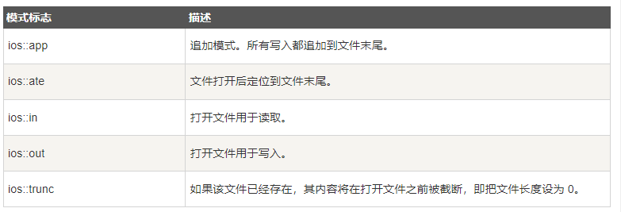
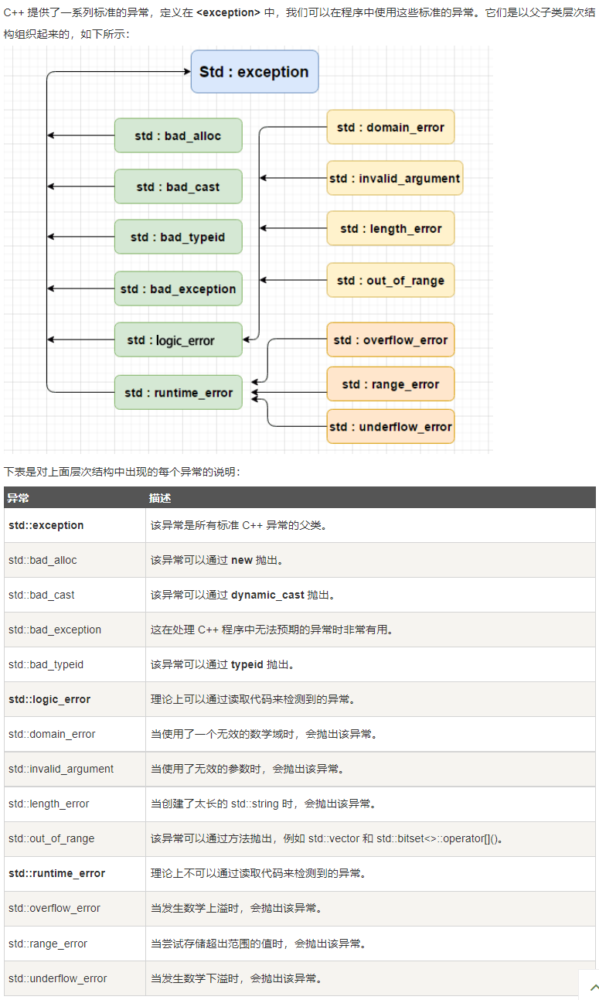

# 1.文件和流
## 1.1.概述
&emsp;&emsp;1.数据类型种类：
&emsp;&emsp;&emsp;&emsp;`ofstream`:该数据类型表示`输出文件流`,用于创建文件并`向文件写入信息`；
&emsp;&emsp;&emsp;&emsp;`ifstream`:该数据类型表示`输入文件流`,用于从文件`读取信息`;
&emsp;&emsp;&emsp;&emsp;`fstream`: 通常表示文件流，且同时具有`ofstream`和`ifstream`两种功能，它可以创建文件，向文件写入信息，文件读取信息;
## 1.2.打开文件
&emsp;&emsp;1.从文件中读取信息或者向文件写入信息之前，必须先打开文件；
&emsp;&emsp;2.`ofstream`和`fstream`对象都可以用来打开文件进行`写`操作；
&emsp;&emsp;3.`ifstream` 对象可以用来打开文件进行`读`操作；
&emsp;&emsp;4.`open()函数`
```c
    void open(const char *filename, ios::openmode mode);
    *filename:需要打开文件的名称和位置
    ios::openmode：被打开的模式
    
```
## 1.3.关闭文件
&emsp;&emsp;1.函数原型`void close()`；
&emsp;&emsp;2.是`ofstream`和`fstream`和`ifstream`对象的一个成员；
## 1.4.写入文件
&emsp;&emsp;`<<`:向文件写入信息；
## 1.5.读取文件
&emsp;&emsp;`>>`:从文件中抽取信息；
## 1.6.文件位置指针
&emsp;&emsp;1.`istream`和`ostream`都提供重新`定位文件指针`的成员函数;
&emsp;&emsp;2.`iostream`对象`seekg`、`ostream`对象`seekp`;
&emsp;&emsp;3.查找方向：`iOS::beg`：从流的开头开始定位；`ios::cur`:从流当前位置开始定位;`ios::end`:从流的末尾开始定位；
****
# 2.异常处理
## 2.1.三个关键字
&emsp;&emsp;1.`throw`:程序`出现异常时`，程序会`抛出一个异常`；
&emsp;&emsp;2.`catch`:在您`想要处理问题`的地方，通过异常处理程序`捕获异常`；
&emsp;&emsp;3.`try`:`try`块中的代码标识被激活的特定异常，它通常后面跟着一个或多个`catch`块；
```c
    try
    {
        // 保护代码
    }catch(ExcepyionName e1)
    {
        // catch 块
    }catch(ExcepyionName e2)
    {
        // catch 块
    }catch(ExcepyionName eN)
    {
        // catch 块        
    }
```
## 2.2.C++标准的异常
;
## 2.3.定义新的异常
&emsp;&emsp;1.可以通过继承和重载`exception`类来定义新的异常；
&emsp;&emsp;2.`throw(A, B, C, D)`:异常规格说明；
****
# 3.动态内存
## 3.1.概述
&emsp;&emsp;1.`栈`：函数内部所有的变量都将占用栈的内存；
&emsp;&emsp;2.`堆`：程序中未使用的内存，在运行时可用于动态内存分配；
## 3.2.`new`和`delete`运算符
&emsp;&emsp;1.`new`通用语法`new data-type`,`data-type`:任意数据类型；
```c
    double* pvalue = NULL;// 初始化指针
    pvalue = new double;// 为变量分配内存
```
&emsp;&emsp;2.`delete`:释放内存；
## 3.3.为数组分配内存
```c
// 一维数组
int *array = new int [m];
delete [] array;
//2.二维数组：
int **array;
// 一维数组长度为m,宽度为n
array = new int *[m];
for(int i = 0; i < m; i++)
{
    array[i] = new int [n];
}
// 释放
for(int i = 0; i < m; i++)
{
    delete [] array[i];   
}
delete [] array;
// 3维数组
int ***array;

array = new int **[m];
for(int i = 0; i < m; i++)
{
    array[i] = new *[n];
    for(int j = 0; j <n; j++)
    {
        array[i][j] = new int[n];
    }
}
// 释放
for()
{
    for(int i = 0; i <m; i++)
    {
        for(int j = 0; j <n; j++)
        {
            delete[] array[i][j];
        }
        delete[] array[i];
    } 
}
delete[] array;
```
## 3.4 对象的动态内存分配
```c
#include <iostream>
using namespace std;

class Box
{
    public:
        Box(){
                cout << "构造函数" << endl;
            }
        ~Box(){
                cout << "析构函数" << endl;
            }
};

int main(int *argc, char* argv[])
{
    Box *myBoxArray = new Box[4];

    delete [] myBoxArray;
    return 0;
}
```
